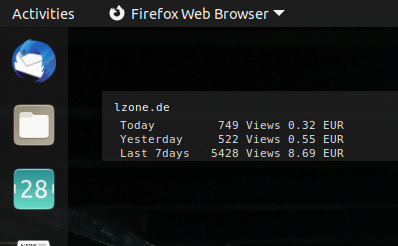
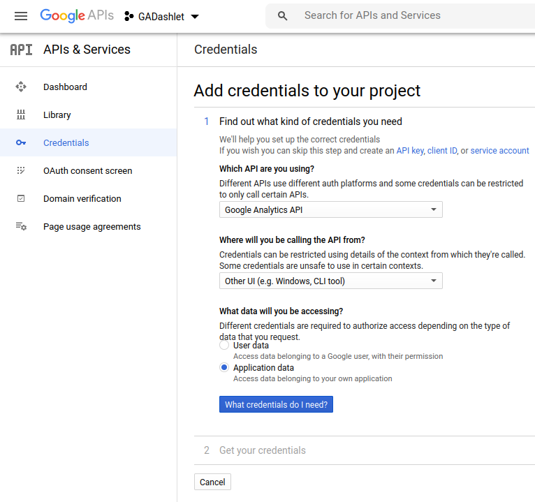

# ga-dashlet

Simple Google Analytics API based live data dashlet

## Usage

    GDK_BACKEND=x11 ./ga-dashlet.py

## Requirements

- Python3
- GTK 3.20+
- Composite support (for transparent window)
- OAuth2Client
- Google API client

To install the Python dependencies run

    pip3 install --upgrade google-api-python-client oauth2-client

## Setup

1. Download the script `ga-dashlet.py`

2. The script requires Google Analytics API credentials and expects
   those in a separate file named `client_secrets.json` in the same
   directory as the script.

3. You can produce a new secret using your Google API Console. Ensure
   to enable the Google Analytics API and in your project create a
   server secret in JSON format as show in the screenshots below
   
   
   
   
## Auto-Start

You probably want to automatically start the script on each login.
This can be done in many ways. One way is to add the following commands
to your ~/.xprofile

    (cd <INSTALL_PATH>/ && sleep 10 && GDK_BACKEND=x11 ./ga-dashlet.py) &

Ensure to replace `INSTALL_PATH` with the correct installation directory!

Note that the sleep is there to ensure the composite manager has started
and the `GDK_BACKEND=x11` is needed to allow persistant window positioning
on Wayland by falling back to X11 protocol as Wayland does not allow
getting/setting the window position.
